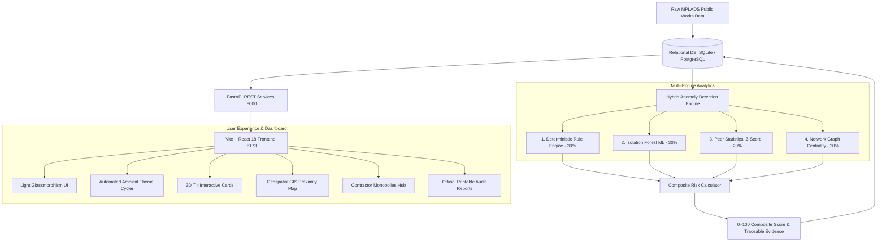

# MPLAD Sentinel Platform — Comprehensive Technical & System Documentation

> **AI-Driven Decision Support, Spatial Analytics & Anomaly Auditing for Public Works Infrastructure**

---

## 1. Executive Summary & Purpose of the Project

### 1.1 What is the MPLAD Scheme?
The **Member of Parliament Local Area Development Scheme (MPLADS)** is a flagship Government of India initiative. Under this scheme, each Member of Parliament (MP) has the entitlement to recommend developmental infrastructure works in their constituency with an annual financial outlay of **₹5 Crore (50 Million INR)**. 

Typical projects include:
- Safe drinking water installations and pipelines
- Primary health sub-centres and public clinics
- Rural and peri-urban roads, culverts, and bridges
- Community halls, public sanitation complexes, and school classrooms
- Solar lighting and public cremation grounds

Across **543 Lok Sabha** and **245 Rajya Sabha** constituencies, this accounts for thousands of crores of public funds distributed across more than **100,000 localized civil works** every year.

---

### 1.2 The Real-World Problem It Solves
Despite the scheme's nationwide impact, public monitoring and auditing face severe operational hurdles:
1. **Massive Scale & Fragmented Records**: Hundreds of thousands of micro-projects are implemented across 700+ district collectorates and municipal bodies. Traditional manual auditing can sample less than 3% of completed works.
2. **Duplicate Sanctions & Ghost Works**: Projects of identical nature are frequently sanctioned within a few hundred meters of each other (e.g. two tube wells or community centers billed at the same coordinates).
3. **Timeline Delays & Front-Loaded Payments**: Funds are often disbursed prematurely (e.g. 70%+ of total contract value released on day 1 as an advance before civil excavation begins), or projects linger for 3+ years past their completion target.
4. **Contractor Monopolies & Cartel Hubs**: A handful of favored contractors corner a disproportionate percentage of total district allocations, often funneling work through identical implementing agencies without competitive bidding.
5. **Cost Inflation**: Certain projects report costs 1.5× to 3× higher than peer median benchmarks for the exact same civil specifications in the same district.

---

### 1.3 What is the Use of the Project?
The **MPLAD Sentinel Platform** is an explainable decision-support and proactive auditing system designed for **District Collectors, MPLAD Monitoring Officers, State Audit Directorates, and Central Oversight Teams**.

**Core Purpose**:
- **Triage & Prioritize Inspections**: Shifts audit inspections from blind random sampling to **data-driven risk prioritization**. Officers immediately see the top 5% highest-risk projects that require physical inspection or documentary verification.
- **Provide Traceable Evidence**: Instead of an opaque "black-box" decision, the platform provides explicit evidence cards comparing observed metrics against peer medians and statutory benchmarks.
- **Preserve Non-Accusatory Human-in-the-Loop Oversight**: The AI does not accuse or declare wrongdoing; it flags statistical, rule-based, and network irregularities to support human administrative oversight.
- **Empower Public Accountability**: Features a modern, responsive **Light Glassmorphism** interface with interactive GIS maps, automated ambient color cycling, contractor dependency profiles, and printable executive audit reports.

---

## 2. Programming Languages & Technologies Used

The project is architected as a high-performance decoupled client-server application utilizing modern industry-standard languages and frameworks:

### 2.1 Language Breakdown

| Language | Primary Domain | How & Where It Is Used |
| :--- | :--- | :--- |
| **Python (v3.10+)** | Backend & ML Engine | Powers the REST API, database ORM, data ingestion, statistical anomaly detection, isolation forest model, and graph centrality algorithms. |
| **TypeScript (v5.7)** | Frontend Logic | Provides static typing, data interfaces, API client definitions, and component architecture for the client application. |
| **JavaScript / JSX (React 18)** | Frontend UI | Powers interactive reactive components, dynamic state hooks, context providers, and lifecycle timers. |
| **HTML5 & CSS3** | Presentation Layer | Custom **Light Glassmorphism** design system with frosted white glass layers, CSS custom properties, 3D card tilt physics, and keyframe animations. |
| **SQL** | Data Persistence | Relational queries, foreign keys, cascading constraints, and indexing over SQLite / PostgreSQL. |

---

### 2.2 Frameworks, Libraries & Tools

#### Backend Stack
- **FastAPI (0.115.6)**: Modern, high-performance asynchronous web framework for building Python REST APIs with automatic OpenAPI (Swagger) documentation.
- **Uvicorn (0.32.1)**: Lightning-fast ASGI web server implementation.
- **SQLAlchemy (2.0.36)**: Enterprise-grade Python Object-Relational Mapper (ORM) for declarative relational database modeling.
- **Scikit-Learn (1.6.0)**: Machine learning toolkit implementing the **Isolation Forest** unsupervised anomaly detector and **RobustScaler**.
- **NetworkX (3.4.2)**: Graph theory and complex network analysis library used to compute degree centrality, eigenvector centrality, and contractor-agency dependency hubs.
- **Pandas (2.2.3) & NumPy (2.1.3)**: High-performance vectorized numerical computation, data frame aggregation, and quantile calculations.
- **Pydantic (2.10.3)**: Data validation and settings management using Python type annotations.
- **SQLite / PostgreSQL (via Psycopg 3)**: Relational database engine supporting fast local development and cloud production deployment.

#### Frontend Stack
- **React (18.3.1)**: Component-based UI library utilizing modern functional components, hooks, and Context API.
- **Vite (6.0.3)**: Next-generation frontend build tool providing instantaneous Hot Module Replacement (HMR) and optimized rollup production bundles.
- **React Router DOM (7.1.1)**: Declarative client-side routing, protected navigation guards, and dynamic parameter parsing.
- **Recharts (2.15.0)**: Composable D3-based charting library used for Donut charts, Bar charts, and Trend Area curves.
- **Leaflet (1.9.4) & React-Leaflet (4.2.1)**: Mobile-friendly interactive GIS mapping library rendering national infrastructure coordinates with custom risk-colored markers.
- **Lucide React (0.468.0)**: Modern, consistent icon toolkit for administrative interfaces.

---

## 3. System Architecture & How It Works (End-to-End Workflow)



---

### 3.1 Step 1: Data Ingestion & Relational Schema
The database models 5 primary entities in [`backend/app/models.py`](file:///e:/sih/backend/app/models.py):
1. **Projects**: Contains project identifiers, MP details, constituency, state, district, project category, GPS coordinates, financial figures (recommended, sanctioned, released, expenditure), milestone dates, and implementing agencies.
2. **Contractors**: Registered business entities, district affiliations, and project links.
3. **Payments**: Date-stamped installment records with disbursed values and payment milestones.
4. **RiskScores**: The computed composite risk score along with the 4 sub-scores.
5. **AnomalyDetails & Alerts**: Specific, actionable flags (e.g., Cost Anomaly, Chronology Error, Duplicate Proximity) with measured versus benchmark expected values.

> [!IMPORTANT]
> **Data Provenance Disclosure**:
> The current prototype uses schema-conforming validation records because direct authorized government data access/export is not available in the development environment. The ingestion pipeline is designed to accept authorized MoSPI/eSAKSHI exports without changing the analytics architecture.

---

### 3.2 Step 2: The Multi-Engine Anomaly Detection Pipeline
The heart of the system is [`backend/app/ml/anomaly_engine.py`](file:///e:/sih/backend/app/ml/anomaly_engine.py). It combines four analytical methods to evaluate every project against its regional peer cohort:

#### 1. Deterministic Rule Engine (Weight: 30%)
Evaluates configurable anomaly-detection heuristics and business validation rules:
- **Budget Exceeded**: Total expenditure or payments exceed the sanctioned budget.
- **Chronology Contradiction**: Payments recorded before official sanction date, or completion date preceding project start date.
- **Abnormal Duration**: Execution duration $< 7$ days (potential paper completion) or $> 900$ days (stalled project).
- **Duplicate Spatial Proximity**: Using the **Haversine Great-Circle Formula**, computes distance between projects of the same category. Works located within **0.5 km** with comparable budgets are flagged for duplicate billing risk:
  $$d = 2r rcsin\left(\sqrt{\sin^2\left(rac{\Delta\phi}{2}
ight) + \cos(\phi_1)\cos(\phi_2)\sin^2\left(rac{\Delta\lambda}{2}
ight)}
ight)$$
- **Missing Coordinate Metadata**: Detects incomplete GPS geotagging.

#### 2. Unsupervised Machine Learning (Weight: 30%)
Uses **Isolation Forest** from `scikit-learn`:
- Transforms 11 numerical dimensions per project:
  1. Normalized sanctioned amount
  2. Duration in days
  3. Cost-to-recommendation ratio
  4. Total payment count
  5. Maximum single payment concentration ratio
  6. Payment variance
  7. District total contractor project count
  8. District contractor value share
  9. Spatial nearest-neighbor distance
  10. Expenditure ratio
  11. Delay variance
- **RobustScaler** neutralizes extreme outliers from skewing the model.
- Projects isolated near the root of isolation trees receive an ML outlier score ($0–100$).

#### 3. Peer Statistical Deviation (Weight: 20%)
Calculates the **Robust Z-Score** against a strictly stratified peer cluster:
$$	ext{Peer Cluster} = \{	ext{State}\} 	imes \{	ext{District}\} 	imes \{	ext{Project Type}\}$$
$$Z = rac{x - 	ext{Median}_{	ext{peer}}}{	ext{IQR}_{	ext{peer}} 	imes 0.7413}$$
- If $|Z| \ge 2.2$, the project deviates significantly from normal pricing for that specific infrastructure type in that exact district.

#### 4. Network Concentration Engine (Weight: 20%)
Constructs an undirected bipartite graph using `NetworkX`:
- **Nodes**: Contractors, Implementing Agencies, Districts, and Projects.
- **Edges**: Contract award relationships and fund disbursement flows.
- Computes **Degree Centrality** and **Volume Share**:
  - Detects if a single contractor captures $> 25\%$ of total district MPLAD funds.
  - Identifies exclusive agency-contractor pipelines (potential favoritism in work allocation).

#### Composite Risk Score Calculation
$$	ext{Composite Score} = 0.30 	imes 	ext{Rules} + 0.30 	imes 	ext{ML} + 0.20 	imes 	ext{Stats} + 0.20 	imes 	ext{Network}$$

- **0 – 30**: Low Risk (Normal progress, routine reporting)
- **31 – 60**: Medium Risk (Minor delays or minor budget variations)
- **61 – 80**: High Risk (Flagged for administrative desk audit)
- **81 – 100**: Critical Risk (Urgent on-site physical verification recommended)

---

### 3.3 Step 3: FastAPI Backend Services
The backend exposes high-speed RESTful JSON endpoints at `http://localhost:8000/api`:
- `GET /api/dashboard/summary?year=...`: Summary counts, financial totals, risk distributions, state breakdowns, category aggregations, and monthly trends.
- `GET /api/projects`: Paginated project register with search, state, district, risk level, and contractor filters.
- `GET /api/projects/{id}`: Detailed investigation dossier with sub-score breakdown, financial timeline, evidence list, and relationship graph.
- `GET /api/contractors`: Contractor intelligence summary with portfolio value, active districts, and high-risk ratio.
- `GET /api/map/projects`: Lightweight GIS coordinate payload for nationwide map rendering.
- `GET /api/alerts`: Real-time audit alert queue with officer review status transitions.
- `POST /api/audit/re-analyze`: Triggers full re-execution of the multi-engine anomaly pipeline.

---

### 3.4 Step 4: Frontend Presentation & User Experience

#### Luxury Light Glassmorphism Design System
- **Surfaces**: Frosted white glass cards (`rgba(255, 255, 255, 0.82)`) with `backdrop-filter: blur(20px)` and soft diffused drop shadows (`0 10px 30px rgba(0, 0, 0, 0.04)`).
- **Typography**: High-contrast slate and charcoal headings (`#0e2720`, `#0b253a`, `#0f172a`) for effortless reading.
- **Ambient Watercolor Orbs**: Four floating radial background mesh orbs continuously float and pulse in the background with soft pastel watercolor blending (`mix-blend-mode: multiply`).

#### Automated Ambient Color Cycler
A hands-free, automated theme engine cycles the whole interface every **7 seconds** with a **1.8-second cubic-bezier transition** across 6 curated light palettes:
1. **Light Mint & Pine** (`#1b6a55` spruce / `#f2f7f4` base)
2. **Light Sky Azure** (`#0284c7` blue / `#f0f6fc` base)
3. **Light Lavender Mist** (`#7c3aed` violet / `#f7f4fd` base)
4. **Light Rose Blossom** (`#e11d48` coral / `#fdf3f5` base)
5. **Light Spring Meadow** (`#059669` jade / `#f2f9f5` base)
6. **Light Golden Honey** (`#d97706` amber / `#fdf8ee` base)

All charts, donut rings, progress bars, and borders automatically synchronize their colors as the theme morphs.

#### Interactive 3D Tilt Cards (`TiltCard`)
Cards physically tilt in 3D space based on mouse position with dynamic specular sheen highlights reflecting off the frosted glass.

#### Live Financial Year Dropdown
Allows monitoring officers to instantly filter the entire national dashboard by fiscal year:
- `2025–26` (Current FY)
- `2024–25` (Previous FY)
- `2023–24`
- `2022–23`
- `All Financial Years` (All-time dataset)

---

## 4. Page-by-Page Feature Directory

| Page | URL Path | Key Features & Capabilities |
| :--- | :--- | :--- |
| **Executive Dashboard** | `/dashboard` | National KPIs, live FY filter, interactive Recharts bar charts, risk breakdown donut, top sectors donut, and quick preview map. |
| **Projects Register** | `/projects` | Searchable tabular list of all works with filters by state, district, risk level, status, and contractor. Features one-click **CSV export**. |
| **Project Investigation** | `/projects/:id` | Full investigation dossier: Composite Risk score breakdown, financial disbursement progress bar, evidence cards, interactive SVG relationship network graph, and officer review modal. |
| **Alerts & Audit Log** | `/alerts` | Severity-ranked alert cards with status workflows (`New` → `Under Review` → `Verified` / `False Positive`). |
| **Contractor Intelligence** | `/contractors` | Contractor concentration matrix, historical project volume, multi-year value timeline, and district exposure. |
| **Geospatial Monitoring** | `/map` | Full-screen interactive Leaflet map rendering all project GPS coordinates with risk-coded pins and clustering. |
| **Executive Reports** | `/reports` | Formal printable audit summaries with anomaly breakdown tables, financial timelines, and official sign-off sections. |
| **Methodology & Safeguards** | `/methodology` | Publicly transparent documentation of the statistical models, weights, and ethical safeguards. |
| **System Settings** | `/settings` | Ingestion hub for uploading CSV/JSON datasets, re-syncing MoSPI official data, viewing batch history, and triggering pipeline runs. |

---

## 5. Official MoSPI eSAKSHI Dataset Integration & Dual Operational Modes

### 5.1 Official Source System
- **Portal**: MoSPI MPLADS–eSAKSHI Portal ([https://mplads.mospi.gov.in/digigov/dashboard.html](https://mplads.mospi.gov.in/digigov/dashboard.html))
- **Authority**: Ministry of Statistics and Programme Implementation (MoSPI), Government of India.
- **Mandate**: Under the revised fund-flow mechanism introduced on 1st April 2023, all works recommended by Hon'ble Lok Sabha and Rajya Sabha MPs (17th and 18th Lok Sabha) are published online.
- **Data Ingestion**: Support for official exports via `POST /api/data/import` and standalone CLI tool `python scripts/import_mplads_data.py`.

### 5.2 Dual Operational Modes
To provide real-world fidelity while enabling evaluator benchmark testing, MPLAD Sentinel operates in dual modes:
1. **Mode 1: Official MoSPI Data**:
   - Contains authentic records extracted from the eSAKSHI portal.
   - Complete data provenance tracked: `source_record_id`, `source_url`, `import_batch_id`, `imported_at`, and `data_quality_status`.
   - Never contaminated with synthetic test data.
2. **Mode 2: Demonstration Showcase Data**:
   - Calibrated synthetic dataset containing known test irregularities for repeatable SIH demonstrations.
3. **Mode 3: All Records**:
   - Macro view across all datasets.

### 5.3 Dynamic Adaptive Anomaly Detection & Weight Normalization
Official public exports frequently omit commercial contractor IDs (due to departmental execution by DRDAs) or GPS coordinates. MPLAD Sentinel dynamically renormalizes weights to maintain a 100% composite score:
- **Baseline Weights**: Rules (30%), ML Isolation Forest (30%), Statistical Z-Score (20%), Network Concentration (20%).
- **When Contractors Unassigned**: Network weight drops to 0%, redistributed proportionally: Rules (40%), ML Isolation Forest (35%), Statistical Z-Score (25%).
- **When Coordinates Missing**: Geographic proximity and spatial clustering checks are skipped without failing; records receive a neutral data-quality completeness flag.

### 5.4 Data Quality Auditing
The system continuously tracks data health metrics:
- Overall Quality Score (out of 100).
- Percentage of geocoded works vs missing coordinates.
- Sanction vs Expenditure budget consistency.
- Ingestion batch audit logs.

For full field mappings, see [`DATA_DICTIONARY.md`](file:///e:/sih/DATA_DICTIONARY.md).

---

## 6. Walkthrough of a Showcase Anomaly: `MPLAD-DEMO-00421`

To illustrate how an auditor uses the platform, the demo dataset includes a calibrated critical irregularity case:

1. **Discovery**: On `/dashboard` or `/alerts`, the auditor notices project `MPLAD-DEMO-00421` flagged with a **Critical Risk Score of 87.0**.
2. **Investigation Dossier**: Clicking the project opens `/projects/MPLAD-DEMO-00421`:
   - **Project Name**: Drinking Water Augmentation & Pipeline Extension
   - **Location**: Ward 17, Melur Road, Madurai, Tamil Nadu
   - **Sanctioned Value**: ₹48,00,000 (Peer median for this category is ₹37,50,000 — **Cost Anomaly** flagged).
   - **Duplicate Proximity**: Located just **0.4 km** from `MPLAD-DEMO-00422` (another drinking water project sanctioned for ₹39,00,000 in the same financial quarter).
   - **Timeline Anomaly**: Mobilization advance payment was issued on **05/05/2024**, **9 days before** the official administrative sanction on **14/05/2024**.
   - **Payment Concentration**: Over 70% of total funds were released in a single installment.
   - **Contractor Monopoly**: The contractor holds $> 28\%$ of all MPLAD drinking water projects in Madurai district.
3. **Auditor Action**: The officer uses the on-screen review modal to log:
   - Status updated to **"Verification Requested"**
   - Notes: *"Field inspection ordered for Ward 17 to check duplicate works against project 00422."*
   - Timestamp and officer credentials recorded in the immutable audit log.

---

## 7. How to Run the Project Locally

### Prerequisites
- **Python 3.10+**
- **Node.js 18+ & npm**

### 1. Backend Server Setup
```bash
# Open terminal in project root
cd backend

# Create virtual environment (optional)
python -m venv venv
# Activate on Windows:
.\venv\Scripts\activate
# Activate on Linux/macOS:
source venv/bin/activate

# Install dependencies
pip install -r requirements.txt

# Start FastAPI server (defaults to port 8000)
python -m uvicorn app.main:app --reload --port 8000
```
- API Base: `http://localhost:8000/api`
- Interactive Swagger UI: `http://localhost:8000/docs`

### 2. Frontend Application Setup
```bash
# Open a second terminal in project root
cd frontend

# Install npm dependencies
npm install

# Start Vite development server
npm run dev
```
- Web Application: **`http://localhost:5173`**

### Demonstration Login Credentials
- **Email**: `officer@mplad.demo`
- **Password**: `Demo@123`
- **Role**: MPLAD Monitoring Officer

---

## 7. Summary & Key Takeaways

1. **What is it?** An AI-assisted decision-support platform that audits Member of Parliament Local Area Development Scheme (MPLADS) public works projects.
2. **What languages are used?** Python (backend, ML, ORM), TypeScript (client logic, type safety), JavaScript/JSX/React 18 (UI components), HTML5 & CSS3 (Light Glassmorphism design system), and SQL (relational database queries).
3. **How does it work?** Ingests project, payment, and contractor records, feeds them into a 4-engine analytical pipeline (Deterministic Rules, Isolation Forest ML, Peer Z-Scores, and Graph Centrality), computes a 0–100 Composite Risk Score, and surfaces traceable evidence on an interactive Light Glassmorphic dashboard with automatic color cycling, GIS maps, and audit logs.
4. **What is its impact?** Enables administrative officers to detect fund leakages, duplicate billing, delayed execution, and contractor monopolies before funds are lost, ensuring maximum transparency and impact for public infrastructure.